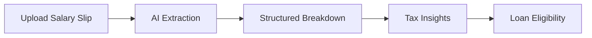

# 💸 PaySense 🏦

### Decode Your Salary. Save Tax. Plan Smart.

> AI-powered salary slip decoder built for Indian salaried employees 🇮🇳

---

## 🚀 Live Demo

👉 https://aistudio.google.com/apps/6bbc0c65-502e-48f8-924c-acf1cd77653f

---

## 🧠 The Problem

Salary slips are confusing.
Most people don’t fully understand:

* Where their salary goes
* How much tax they actually pay
* How to save more

---

## 💡 The Solution — PaySense

PaySense uses AI to turn complex salary slips into **clear insights + actionable financial decisions**.

---

## ✨ Features

### 📄 AI Salary Breakdown

* Extracts and explains:

  * Basic Pay
  * HRA
  * PF
  * TDS
  * Gross & Net Salary

---

### 💸 Smart Tax Saving Suggestions

* Personalized recommendations under:

  * 80C (PF, ELSS, LIC, etc.)
  * 80D (Health Insurance)

---

### 🏦 Loan Eligibility Estimator

* Based on **40% EMI rule**
* Helps you understand safe borrowing capacity instantly

---

## ⚙️ How It Works



---

## 🛠 Tech Stack

* **Frontend:** React + TypeScript + Vite
* **AI:** Google Gemini (Vision)
* **Platform:** Google AI Studio

---

## 📦 Run Locally

```bash
# Clone the repo
git clone <your-repo-link>

# Move into folder
cd paysense

# Install dependencies
npm install

# Add API key
# Create .env.local
GEMINI_API_KEY=your_api_key_here

# Run app
npm run dev
```

---

## 🎯 Use Cases

* 👨‍🎓 Freshers decoding first salary
* 💼 Professionals optimizing taxes
* 🏦 Loan planning & EMI decisions

---

## 🔮 Future Scope

* 📊 Old vs New Tax Regime Comparison
* 📈 Salary Insights Dashboard
* 🤖 AI Financial Advisor
* 📱 Mobile App / PWA

---

## 🏆 Why This Project Stands Out

* Solves a **real Indian problem** 🇮🇳
* Combines **AI + FinTech**
* Provides **actionable insights, not just data**
* Beginner-friendly yet impactful

---

## 🤝 Contributing

Pull requests are welcome!
If you’d like to improve this project, feel free to fork and contribute.

---

## 📜 License

MIT License

---

## ⭐ Show Your Support

If you liked this project, give it a ⭐ on GitHub!
